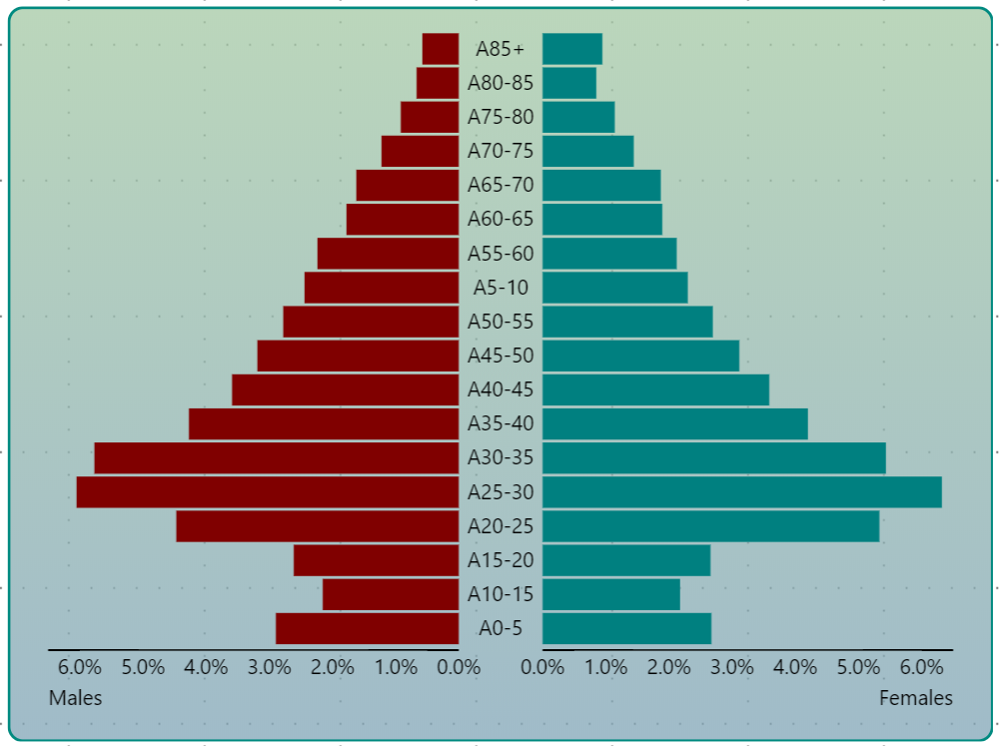
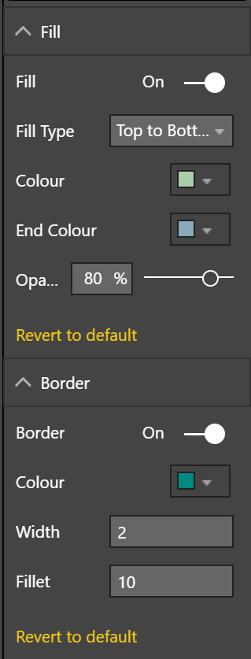

# powerBI-visual-Background3
Power BI custom visual showing a customisable rectangle

  

This custom visual for Microsoft Power BI displays a rectange and is intended to replace the rectangle shape within Power BI. This custom visual is different from the built in shape:
+ Choice of solid and gradient fills
+ Fixed fillet radius (pixels), compared with fillets calculated as percentage of shape height (varies depending upon the size of the rectangle producing an uneven appearance when several rounded rectangles of differing sizes are placed on a page)
+ Rectangle is flush with the top and left of the frame (the built in shape has a variable margin which changes with the size of the visual which gives an uneven look to the page).

**Configuration Options**

This visual does not require any data.
